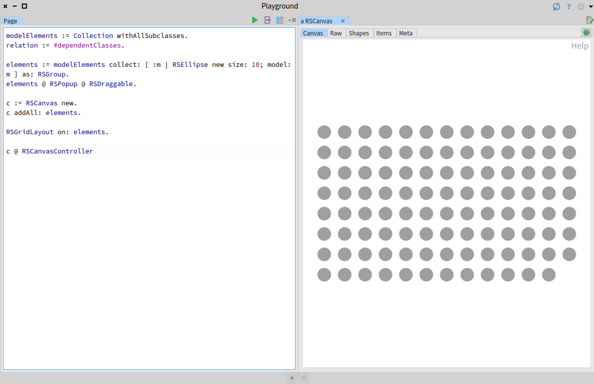
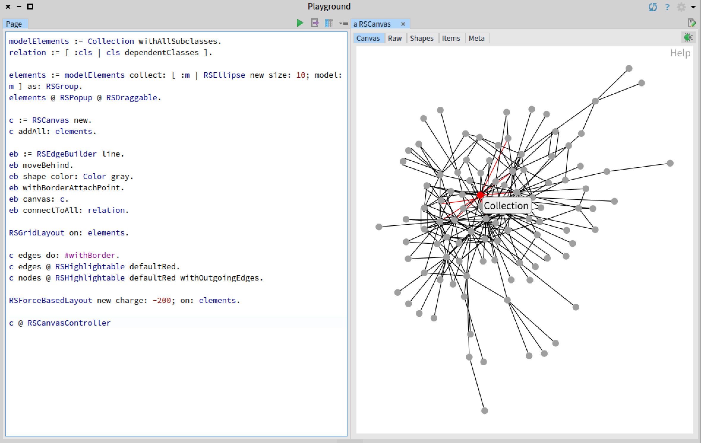
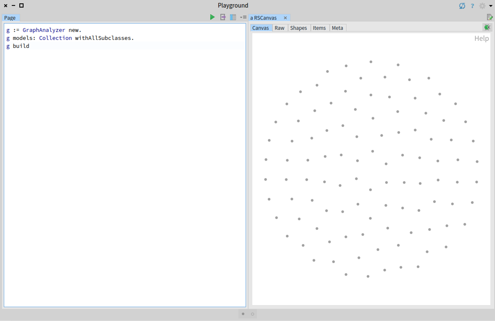
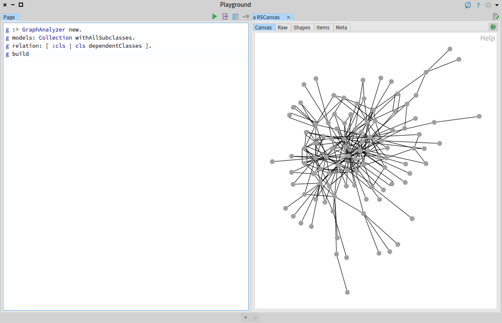
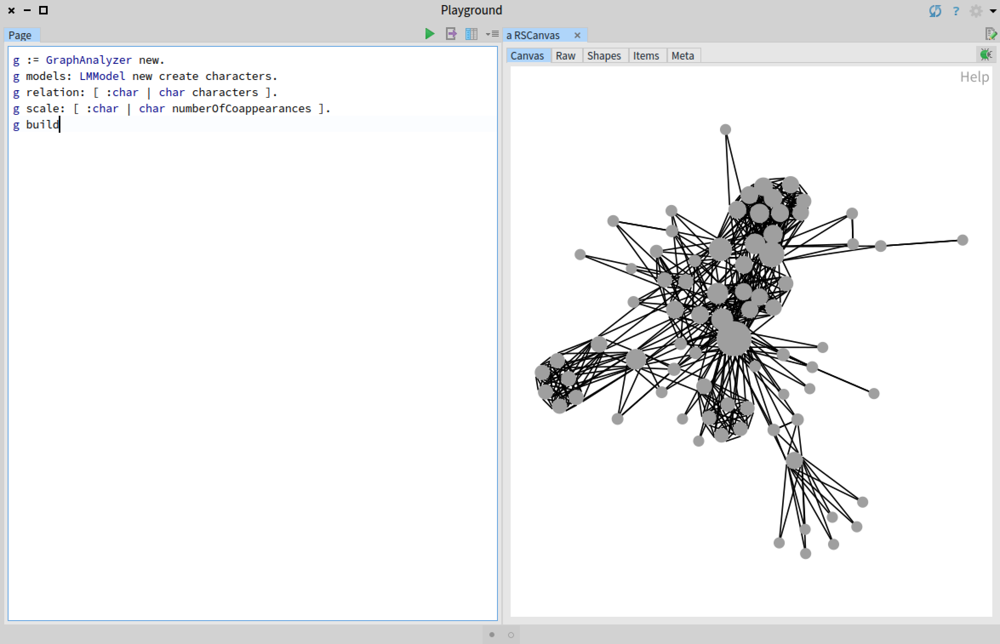

# Tutorial 02 - Graph Manipulation

This tutorial is about building a small tool to manipulate graph. It is composed of two main steps:

 - Part 1: scripting the graph visualization
 - Part 2: turning our script as a small object-oriented application

## Part 1: scripting the graph visualization

### A canvas and some nodes

A playground is a fantastic tool to easily experiment in an incremental fashion. One can easily add a couple of lines of code and immediately enjoy the result. Using the playground is therefore a natural way to experiment.

We will visualize dependencies between some Pharo classes. Since a class is an object in Pharo, visualizing class dependencies is very handy since data is ready. No need to rely on an external source of data.

As a start, we can write in a playground:

```Smalltalk
modelElements := Collection withAllSubclasses.
relation := [ :cls | cls dependentClasses ].

elements := modelElements collect: [ :m | RSEllipse new size: 10; model: m ] as: RSGroup.
elements @ RSPopup @ RSDraggable.

c := RSCanvas new.
c addAll: elements.

RSGridLayout on: elements.

c @ RSCanvasController
```

The following figure gives the result of the script.


The variable `modelElements` contains a list of objects. Our visualization represents a graphical element for each objects contained in this variable. Since we are interested in visualize a few Pharo classes, we assign all the classes defining the collection class hierarchy.

The variable `relation` contains a one argument block that takes a class and returns the list of classes on which the argument depends on. For example, the expression `Array dependentClasses` returns `{ArrayedCollection. WriteStream. DependentsArray. Array class. Array}` which means that the class `Array` depends on the classes `ArrayedCollection`, `WriteStream`, `DependentsArray`, and `Array class` (the metaclass of `Array`).

The variable `elements` contains a list of visual elements. Each class is represented by an ellipse, of a size 10. Each ellipse had an object model, the represented class. This model is necessary for drawing edges between models and for the popup text. The collections needs to be a `RSGroup` class as this class provide convenient methods related to the visual rendering.

The visual elements are added to a canvas. The expression `elements @ RSPopup @ RSDraggable` makes all the visual elements have a popup and are made draggable. For now, we simply use a gridlayout to order the visual elements. We then made the canvas controllable using `c @ RSCanvasController`.

### Adding edges

Edges may be added using an `RSEdgeBuilder`. This class offers a small API to create and add edges at a low effort.

```Smalltalk
modelElements := Collection withAllSubclasses.
relation := [ :cls | cls dependentClasses ].

elements := modelElements collect: [ :m | RSEllipse new size: 10; model: m ] as: RSGroup.
elements @ RSPopup @ RSDraggable.

c := RSCanvas new.
c addAll: elements.

eb := RSEdgeBuilder line.
eb moveBehind.
eb shape color: Color gray.
eb withBorderAttachPoint.
eb canvas: c.
eb connectToAll: relation.

RSGridLayout on: elements.

c edges do: #withBorder.
c edges @ RSHighlightable defaultRed.
c nodes @ RSHighlightable defaultRed withOutgoingEdges.

RSForceBasedLayout new charge: -200; on: elements.

c @ RSCanvasController
```

The expression `RSEdgeBuilder line` create an edge builder ready to produce simple straight lines. The expression `eb moveBehind` indicates that the lines have to be added _behind_ the nodes. Often, it is visually pleasant to not have edges that hide the nodes. The expression `eb shape color: Color gray` defines the visual aspect of the line.

The expression `eb withBorderAttachPoint.` indicates that the attach point of the edge should be the border of the visual element. We need to indicate to the edge builder where to find the elements to connect. We use the expression `eb canvas: c` for that purpose.

Finally, nodes are connected using the expression `eb connectToAll: relation`. Since the block provided to `relation` returns a collection of model objects, we use `connectToAll:` to connect each visual element to a number of other visual elements.

We add a bit of interaction to make visual element highlightable. The three lines:
```Smalltalk
c edges do: #withBorder.
c edges @ RSHighlightable defaultRed.
c nodes @ RSHighlightable defaultRed withOutgoingEdges.
```
make the visual elements aware of the mouse movement. If the mouse is above a node, it is highlighted as well as outgoing edges.

Result of the script is represented below:




## Part 2: turning our script as a small object-oriented application

In this second part of the tutorial, we will turn our script into a small application to visualize graphs. We can create a package named `GraphAnalyzer`. This package will contains our small application.

We define the class `GraphAnalyzer` as follows:

```Smalltalk
Object subclass: #GraphAnalyzer
	instanceVariableNames: 'canvas models relation elements layout'
	classVariableNames: ''
	package: 'GraphAnalyzer'
```

We make sure an instance is properly initialized with:

```Smalltalk
GraphAnalyzer>>initialize
	super initialize.
	canvas := RSCanvas new.
	canvas @ RSCanvasController.
	layout := RSForceBasedLayout new charge: -200.
```

We define a force based layout as a default layout. We define a few methods to configure our graph analyzer. The layout is set using:

```Smalltalk
GraphAnalyzer>>layout: aLayout
	layout := aLayout
```

Models may be set using:

```Smalltalk
GraphAnalyzer>>models: someObjects
	models := someObjects.
	elements := someObjects collect: [ :m | RSEllipse new size: 10; model: m ] as: RSGroup.
	canvas addAll: elements.

	elements @ RSPopup @ RSDraggable.
```

And finally we define the build method:

```st
GraphAnalyzer>>build
    layout on: elements.
    ^ canvas
```

We can now try our first script:

```Smalltalk
g := GraphAnalyzer new.
g models: Collection withAllSubclasses.
g build
```

The script produces the following figure:



We can set the layout using a `layout:` instruction:

```Smalltalk
g := GraphAnalyzer new.
g models: Collection withAllSubclasses.
g layout: RSGridLayout new.
g build
```


We can offer a simple way to create edges:

```Smalltalk
GraphAnalyzer>>relation: aOneArgBlock
	| eb |
	eb := RSEdgeBuilder line.
	eb moveBehind.
	eb shape color: Color gray.
	eb withBorderAttachPoint.
	eb canvas: canvas.
	eb connectToAll: aOneArgBlock.

	canvas edges do: #withBorder.
	canvas edges @ RSHighlightable defaultRed.
	canvas nodes @ RSHighlightable defaultRed withOutgoingEdges.
```

The following code produce the same result than our original script:

```Smalltalk
g := GraphAnalyzer new.
g models: Collection withAllSubclasses.
g relation: [ :cls | cls dependentClasses ].
g build
```



## Highlight part of the graph

We can add a simple way to highlight portion of the graph. Consider the method:

```Smalltalk
GraphAnalyzer>>highlight: aString color: aColor
	canvas nodes do: [ :s | (('*', aString, '*') match: s model asString)
								ifTrue: [ s color: aColor ] ]
```

We can then highlight some classes matching some particular patterns, as follows:

```Smalltalk
g := GraphAnalyzer new.
g models: Collection withAllSubclasses.
g relation: [ :cls | cls dependentClasses ].
g highlight: 'Set' color: Color blue.
g highlight: 'Hash' color: Color green.
g highlight: 'Dictionary' color: Color yellow.
g build
```


## Scaling elements

For now, all the classes have the same size. We can map the size to a given metric on the model objects. Consider the method:

```Smalltalk
GraphAnalyzer>>scale: aOneBlockArg
	RSNormalizer size
		shapes: elements;
		from: 8;
		to: 25;
		normalize: aOneBlockArg
```

The figure illustrates the result:


## Applying to a different dataset

So far, we have used some Pharo classes as the represented objects. We can use any datasets. Consider the [_Les Miserables_ dataset](https://github.com/bergel/LesMiserables), which may be loaded using:

```Smalltalk
Metacello new
    baseline: 'LesMiserables';
    repository: 'github://bergel/LesMiserables';
    load.
```

We can then visualize the characters of the novel:

```Smalltalk
g := GraphAnalyzer new.
g models: LMModel new create characters.
g relation: [ :char | char characters ].
g scale: [ :char | char numberOfCoappearances ].
g build
```

The script produces the figure:




## What have we seen in this tutorial?

This tutorial illustrates how to visualize a simple graph model. It further shows how to build a small API, that is independent of the visualized domain.

The small `GraphAnalyzer` application may be extended in many different ways. For example, a scaling may be performed on colors. Some particular elements may use a particular layout (e.g., elements that are not connected may be set as a grid, while the connected visual elements may use a force based layout). We leave these possibles extension as an exercise to the readers.

Please, share your result on the `#Roassal` [discord channel](https://discord.gg/QewZMZa).
